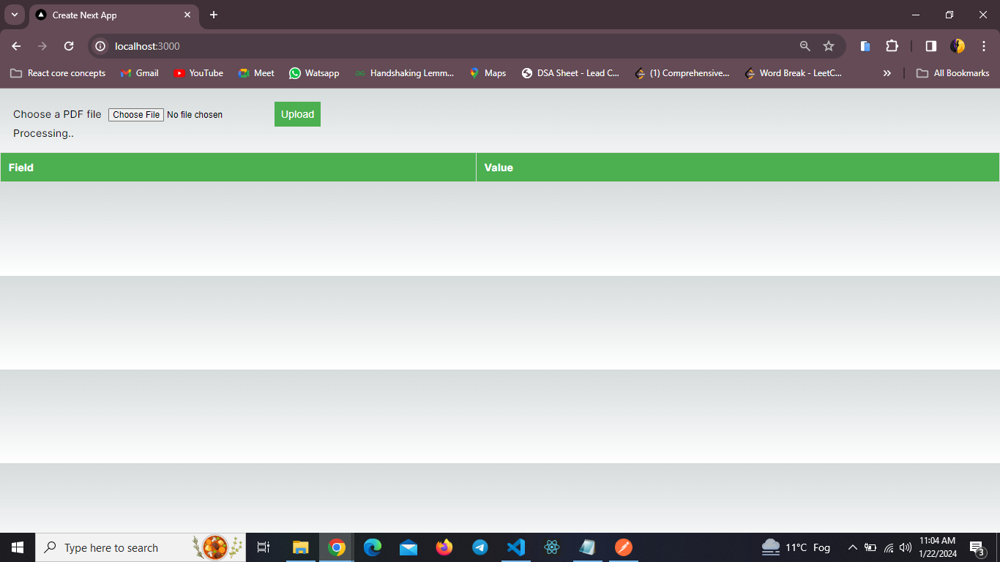
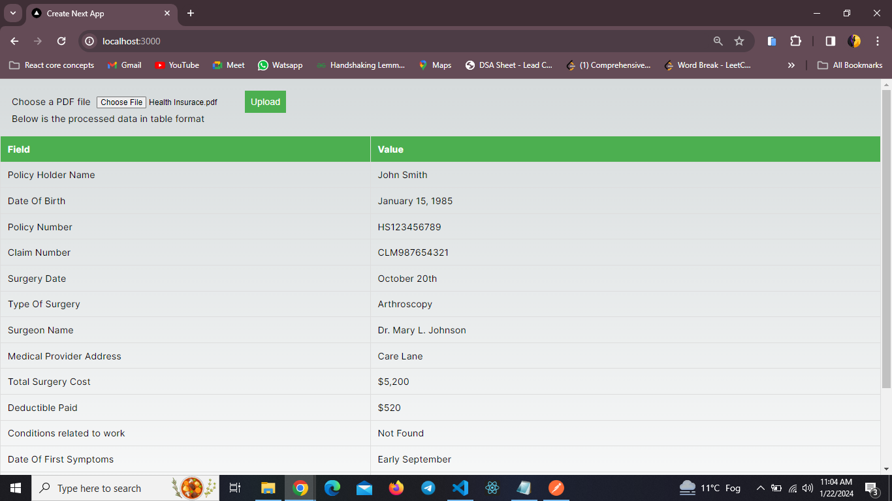

# TEXT EXTRACTER

Welcome to the Text Extracter! This project utilizes Long Chain for prompt-based text extraction and OpenAI for key-value pair generation. The extracted data is displayed in a table format within a Next.js app.

## Setup

Follow the steps below to set up the project locally:

### Prerequisites

Make sure you have the following installed:

- Next JS 14.0

### Installation

1. Clone the repository:
   git clone https://github.com/sumit7894/langchain.git

2. cd your-project

3. npm install

4. Create a .env.local file in the root of your project and add the following:
OPENAI_API_KEY=your_openai_api_key
Replace your_openai_api_key with your actual OpenAI API key.

5. Running the App
  npm run dev
The app should be running at http://localhost:3000.

# Screen shots 

## Home page

## Output

